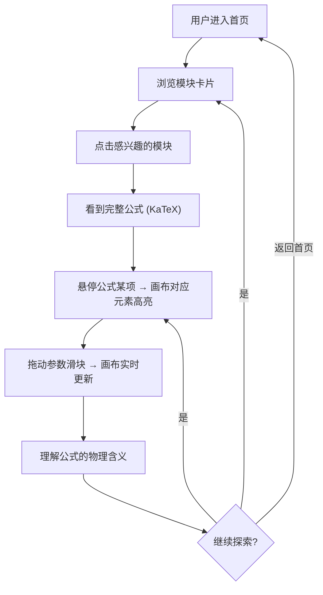

# 信号实验室 (Signal Lab) — 产品需求文档

## 1. 产品概述

信号实验室是一个面向通信工程学习者的交互式可视化平台，核心理念是**将抽象的数学公式转化为可操作的物理直觉**。每个模块通过"公式展示 → 逐项高亮 → 参数探索 → 物理直觉"四步交互流程，让用户拖动滑块、悬停公式项、观察实时动画，在操作中理解公式背后的物理含义，告别死记硬背。

- **目标用户**：通信工程专业本科生/研究生、自学信号处理的工程师、对数学可视化感兴趣的学习者
- **核心价值**：填补"公式推导"与"物理理解"之间的鸿沟，让每一个数学符号都有对应的可视化表达

## 2. 核心功能

### 2.1 用户角色

| 角色 | 说明 |
|------|------|
| 学习者 | 无需注册，直接访问各模块进行交互探索 |

### 2.2 功能模块

1. **首页导航**：模块卡片式入口，每个卡片展示核心公式预览和一句话"回答的问题"
2. **傅里叶变换模块**：公式逐项拆解、谐波叠加动画、时域/频域联动高亮
3. **星座图模块**：I/Q 正交载波可视化、判决边界、散点加噪实时演示
4. **采样定理模块**：采样脉冲动画、频谱周期延拓、欠采样混叠对比
5. **卷积模块**：翻转→滑动→乘积累加的逐帧动画
6. **AM/FM 调制模块**：调制指数调节、边带频谱联动、三路波形对比

### 2.3 页面详情

| 页面名称 | 模块名称 | 功能描述 |
|----------|----------|----------|
| 首页 | Hero 区域 | 品牌标题"信号实验室"，副标题"让公式不再抽象"，滚动引导箭头 |
| 首页 | 模块卡片网格 | 6 个模块卡片，每个展示核心公式(KaTeX)、一句话问题、跳转按钮 |
| 傅里叶变换 | 公式面板 | KaTeX 渲染完整傅里叶变换公式，支持逐项悬停高亮 |
| 傅里叶变换 | 时域画布 | Canvas 绘制原始信号波形，谐波逐次叠加动画 |
| 傅里叶变换 | 频域画布 | Canvas 绘制频谱图，与时域画布联动高亮 |
| 傅里叶变换 | 参数控制栏 | 谐波数量滑块、基频调节、信号类型切换(方波/锯齿/三角) |
| 星座图 | 公式面板 | 展示 I/Q 调制公式，悬停高亮 cos/sin 的正交性 |
| 星座图 | 星座图画布 | 实时绘制散点图，支持 BPSK/QPSK/16QAM 切换 |
| 星座图 | 噪声控制栏 | AWGN 噪声功率滑块，判决边界显示/隐藏 |
| 采样定理 | 公式面板 | 采样定理公式，悬停展示各项物理含义 |
| 采样定理 | 时域画布 | 原连续信号 + 采样脉冲 + 采样后离散序列三层叠加 |
| 采样定理 | 频域画布 | 频谱周期延拓动画，展示混叠发生过程 |
| 采样定理 | 参数控制栏 | 信号频率滑块、采样频率滑块、对比模式(正常/欠采样) |
| 卷积 | 公式面板 | 卷积积分公式，悬停展示翻转/滑动/乘积累加 |
| 卷积 | 卷积动画画布 | 两信号上下排列，阴影滑块展示当前积分范围，实时乘积区域 |
| 卷积 | 结果画布 | 卷积输出波形实时绘制 |
| AM/FM 调制 | 公式面板 | 调制公式，展示调制指数物理含义 |
| AM/FM 调制 | 三路波形画布 | 载波/调制信号/已调信号上下排列对比 |
| AM/FM 调制 | 频谱画布 | 展示载波频率两侧边带的实时变化 |
| AM/FM 调制 | 参数控制栏 | 调制指数滑块、载波频率、调制信号频率、AM/FM 切换 |

## 3. 核心流程

## 4. 用户界面设计

### 4.1 设计风格

- **主题**：暗色科技风 (Dark Tech)，深色背景模拟实验室/示波器环境
- **主色调**：
  - 背景：深蓝黑 `#0a0e27` → `#141832`
  - 主强调色：电光青 `#00e5ff`（波形/高亮）
  - 次强调色：信号绿 `#00ff88`（公式/正确状态）
  - 警告色：琥珀橙 `#ff9100`（噪声/错误状态）
  - 文字：雾白 `#e0e0e0`，次要文字 `#8892b0`
- **字体**：
  - 标题：JetBrains Mono（等宽科技感）
  - 正文：系统默认中文字体
  - 公式：KaTeX 默认数学字体
- **视觉效果**：Canvas 画布模拟示波器网格线、信号波形带发光效果(glow)、卡片带微妙边框发光
- **布局**：单页应用，顶部导航栏 + 全屏内容区
- **图标**：lucide-react 图标库

### 4.2 页面设计概览

| 页面名称 | 模块名称 | UI 元素 |
|----------|----------|---------|
| 首页 | Hero | 大标题居中，网格背景动画，向下滚动提示 |
| 首页 | 模块卡片 | 3列网格，每卡片含公式缩略、问题标题、悬停发光边框 |
| 各模块页 | 公式面板 | 左侧固定面板，KaTeX 公式，悬停项带脉冲高亮动画 |
| 各模块页 | Canvas 画布 | 占据主要区域，深色背景+示波器网格线，波形带发光 |
| 各模块页 | 参数控制栏 | 底部或右侧，滑块/开关/下拉，实时反馈 |

### 4.3 响应式

- **桌面优先**：1920×1080 为主要设计尺寸，最小支持 1280×720
- **移动端**：Canvas 画布缩放适配，参数面板折叠为底部抽屉

## 5. 公式可视化交互规范

每个模块必须实现的四步交互：

| 步骤 | 交互方式 | 视觉反馈 |
|------|----------|----------|
| ① 公式展示 | KaTeX 渲染完整公式，公式置于画布旁 | 静态公式，各项正常显示 |
| ② 逐项高亮 | 鼠标悬停公式的某一项（如 `e^{-jωt}`） | 公式该项脉冲发光 + 画布对应视觉元素同步高亮（如旋转向量亮起） |
| ③ 参数探索 | 拖动参数滑块（如 ω、谐波数 N） | 公式中对应参数实时变色 + 画布动画平滑过渡 |
| ④ 物理直觉 | 预设的"场景模式"（如"对比欠采样 vs 正常采样"） | 画布展示对比动画，底部浮现一句"直觉总结"文字 |
