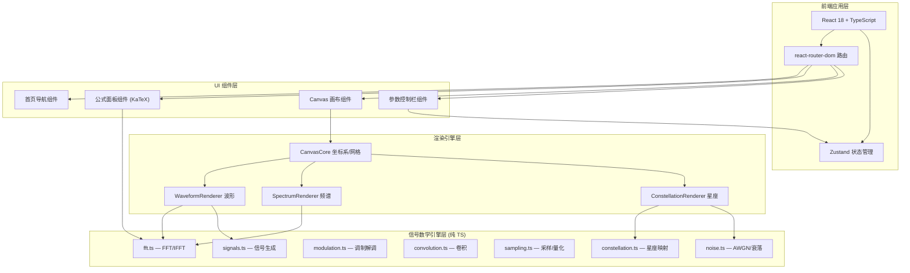

# 信号实验室 (Signal Lab) — 技术架构文档

## 1. 架构设计



## 2. 技术选型

| 类别 | 技术 | 版本 | 用途 |
|------|------|------|------|
| 框架 | React | 18 | UI 组件开发 |
| 语言 | TypeScript | 5.x | 类型安全 |
| 构建 | Vite | 6.x | 开发/打包 |
| 样式 | Tailwind CSS | 3.x | 原子化样式 |
| 路由 | react-router-dom | 7.x | 页面路由 |
| 状态 | Zustand | 5.x | 全局参数状态 |
| 公式 | KaTeX | 最新 | 数学公式渲染 |
| 图标 | lucide-react | 最新 | SVG 图标 |
| 测试 | Vitest | 最新 | 单元测试 |
| 初始化 | vite-init | react-ts 模板 | 项目脚手架 |

## 3. 路由定义

| 路由 | 页面组件 | 用途 |
|------|----------|------|
| `/` | `Home.tsx` | 首页模块导航 |
| `/fourier` | `Fourier.tsx` | 傅里叶变换可视化 |
| `/constellation` | `Constellation.tsx` | 星座图可视化 |
| `/sampling` | `Sampling.tsx` | 采样定理可视化 |
| `/convolution` | `Convolution.tsx` | 卷积可视化 |
| `/modulation` | `Modulation.tsx` | AM/FM 调制可视化 |

## 4. 目录结构

```
signal-lab/
├── src/
│   ├── engine/                    # 信号数学引擎（纯 TS，零 UI 依赖）
│   │   ├── fft.ts                 #   FFT/IFFT 实现
│   │   ├── signals.ts             #   信号生成函数
│   │   ├── modulation.ts          #   AM/FM/PM 调制
│   │   ├── convolution.ts         #   离散卷积
│   │   ├── sampling.ts            #   采样/量化/重建
│   │   ├── constellation.ts       #   星座映射/判决
│   │   ├── noise.ts               #   AWGN 噪声生成
│   │   └── __tests__/             #   引擎单元测试
│   ├── renderer/                  # Canvas 渲染引擎
│   │   ├── CanvasCore.ts          #   坐标系/网格/变换
│   │   ├── WaveformRenderer.ts    #   时域波形渲染
│   │   ├── SpectrumRenderer.ts    #   频谱渲染
│   │   └── ConstellationRenderer.ts # 星座图渲染
│   ├── components/                # 通用 UI 组件
│   │   ├── FormulaPanel.tsx       #   KaTeX 公式面板（支持逐项高亮）
│   │   ├── SignalCanvas.tsx       #   Canvas 画布包装器
│   │   ├── ParamSlider.tsx        #   参数滑块组件
│   │   ├── ParamSelect.tsx        #   参数下拉选择
│   │   ├── OscilloscopeGrid.tsx   #   示波器网格背景
│   │   └── ModuleLayout.tsx       #   模块页通用布局（公式面板+画布+控制栏）
│   ├── pages/                     # 页面
│   │   ├── Home.tsx               #   首页
│   │   ├── Fourier.tsx            #   傅里叶变换
│   │   ├── Constellation.tsx      #   星座图
│   │   ├── Sampling.tsx           #   采样定理
│   │   ├── Convolution.tsx        #   卷积
│   │   └── Modulation.tsx         #   调制
│   ├── store/                     # Zustand 状态
│   │   └── useParamsStore.ts      #   全局参数状态
│   ├── App.tsx                    # 根组件
│   ├── main.tsx                   # 入口
│   └── index.css                  # 全局样式 + Tailwind
├── index.html
├── package.json
├── tsconfig.json
├── vite.config.ts
├── tailwind.config.js
└── postcss.config.js
```

## 5. 数据模型

### 5.1 引擎层数据结构

```typescript
// 复数
interface Complex {
  re: number;
  im: number;
}

// 信号定义
interface Signal {
  samples: Float64Array;  // 采样值
  sampleRate: number;     // 采样率 (Hz)
  duration: number;       // 时长 (s)
  label: string;          // 标签
}

// 频谱定义
interface Spectrum {
  magnitudes: Float64Array;  // 幅度谱
  phases: Float64Array;      // 相位谱
  frequencies: Float64Array; // 频率轴 (Hz)
  resolution: number;        // 频率分辨率
}

// 星座点
interface ConstellationPoint {
  i: number;      // 同相分量
  q: number;      // 正交分量
  symbol: string; // 符号标签 (如 "00", "01")
}

// 渲染参数
interface RenderParams {
  timeStart: number;    // 时间窗起始
  timeEnd: number;      // 时间窗结束
  yMin: number;         // Y 轴下界
  yMax: number;         // Y 轴上界
  gridColor: string;    // 网格颜色
  waveColor: string;    // 波形颜色
  glowEnabled: boolean; // 发光效果
}
```

### 5.2 状态管理 (Zustand)

```typescript
interface AppState {
  // 傅里叶变换参数
  fourier: {
    signalType: 'square' | 'sawtooth' | 'triangle';
    baseFrequency: number;
    harmonicCount: number;
    hoveredTerm: string | null; // 悬停的公式项
  };
  // 星座图参数
  constellation: {
    modulationType: 'BPSK' | 'QPSK' | '16QAM';
    noisePower: number;
    showDecisionBoundary: boolean;
  };
  // 采样定理参数
  sampling: {
    signalFrequency: number;
    sampleFrequency: number;
    mode: 'normal' | 'undersample';
  };
  // 卷积参数
  convolution: {
    signalType1: string;
    signalType2: string;
    animationProgress: number;
    isPlaying: boolean;
  };
  // 调制参数
  modulation: {
    modulationType: 'AM' | 'FM';
    carrierFrequency: number;
    messageFrequency: number;
    modulationIndex: number;
  };
}
```

## 6. 核心引擎 API 设计

```typescript
// fft.ts
function fft(signal: Float64Array): { real: Float64Array; imag: Float64Array };
function ifft(spectrum: { real: Float64Array; imag: Float64Array }): Float64Array;
function computeSpectrum(signal: Float64Array, sampleRate: number): Spectrum;

// signals.ts
function generateSine(frequency: number, sampleRate: number, duration: number): Signal;
function generateSquare(frequency: number, sampleRate: number, duration: number, harmonics: number): Signal;
function generateSawtooth(frequency: number, sampleRate: number, duration: number, harmonics: number): Signal;

// convolution.ts
function convolve(signal1: Signal, signal2: Signal): Signal;
function convolveStepByStep(signal1: Signal, signal2: Signal, step: number): { partial: Float64Array; outputSample: number };

// sampling.ts
function sampleSignal(continuousSignal: Signal, sampleRate: number): Signal;
function reconstructZOH(sampledSignal: Signal, originalRate: number): Signal;

// constellation.ts
function generateConstellation(type: 'BPSK' | 'QPSK' | '16QAM'): ConstellationPoint[];
function modulateSymbols(symbols: number[], type: string, carrierFreq: number, sampleRate: number): Signal;
function addAWGN(constellation: ConstellationPoint[], noisePower: number): ConstellationPoint[];

// noise.ts
function awgn(signal: Float64Array, snrDb: number): Float64Array;
function generateAWGN(length: number, power: number): Float64Array;
```

## 7. Canvas 渲染引擎设计

### 7.1 CanvasCore

```
职责：坐标系变换、网格绘制、视口管理
- worldToScreen(x, y) → { sx, sy }  世界坐标 → 屏幕像素
- screenToWorld(sx, sy) → { x, y }  屏幕像素 → 世界坐标
- drawGrid(ctx, params)              绘制示波器网格
- drawAxes(ctx, params)              绘制坐标轴
- setViewport(left, right, top, bottom) 设置视口范围
```

### 7.2 WaveformRenderer

```
职责：将 Signal 数据渲染为波形曲线
- 支持发光效果 (shadowBlur)
- 支持多条波形叠加渲染（不同颜色）
- 支持填充区域（如积分阴影区域）
```

### 7.3 动画循环

```
使用 requestAnimationFrame：
1. 读取 Zustand 参数状态
2. 调用信号引擎重新计算
3. 调用渲染器绘制到 Canvas
4. 检查参数是否变化，变化则重新计算
```

## 8. 公式面板组件设计

`FormulaPanel` 组件接收一个公式描述数组，每项可独立高亮：

```typescript
interface FormulaTerm {
  id: string;           // 唯一标识
  latex: string;        // KaTeX 片段
  description: string;  // 悬停提示文字
  canvasHighlight: string; // 关联的画布元素 ID
}

// 使用示例：傅里叶变换
const fourierFormula: FormulaTerm[] = [
  { id: 'F', latex: 'F(\\omega)', description: '频谱函数', canvasHighlight: 'spectrum' },
  { id: 'eq', latex: '=', description: '', canvasHighlight: '' },
  { id: 'integral', latex: '\\int_{-\\infty}^{\\infty}', description: '对所有时间积分', canvasHighlight: 'timeline' },
  { id: 'ft', latex: 'f(t)', description: '原始时域信号', canvasHighlight: 'waveform' },
  { id: 'exp', latex: 'e^{-j\\omega t}', description: '旋转向量，角频率 ω', canvasHighlight: 'rotating-vector' },
  { id: 'dt', latex: 'dt', description: '无穷小时间间隔', canvasHighlight: '' },
];
```
